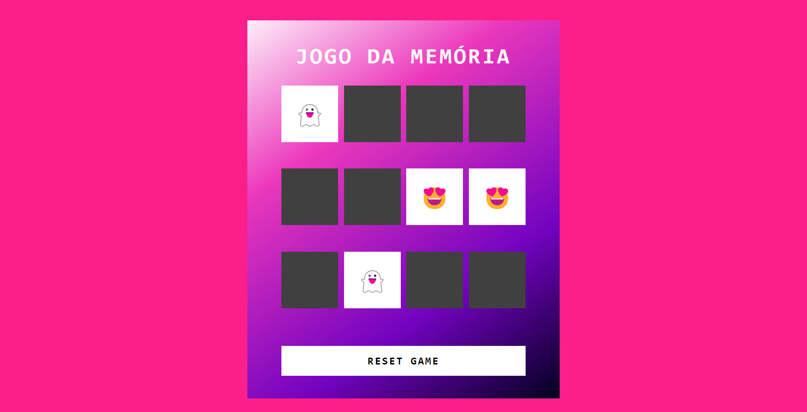

## Awesome JSGame Jogo da Memória

  

Bem-vindo ao **Jogo da Memória**! Neste repositório, você encontrará um  divertido jogo da memória.  Este projeto não apenas oferece entretenimento, mas também demonstra técnicas de desenvolvimento de jogos em JavaScript.

### Créditos

Este jogo foi desenvolvido no desafio "Criando um Jogo da memória com Emojis Utilizando Javascript" no BootCamp Potência Tech iFood - Desenvolvimento de Jogos da DIO. 
---

### Tecnologias Utilizadas

- HTML5 e CSS3 para a estrutura e aparência do jogo.
- JavaScript para a lógica de programação e interatividade.

### Funcionalidades Incríveis
